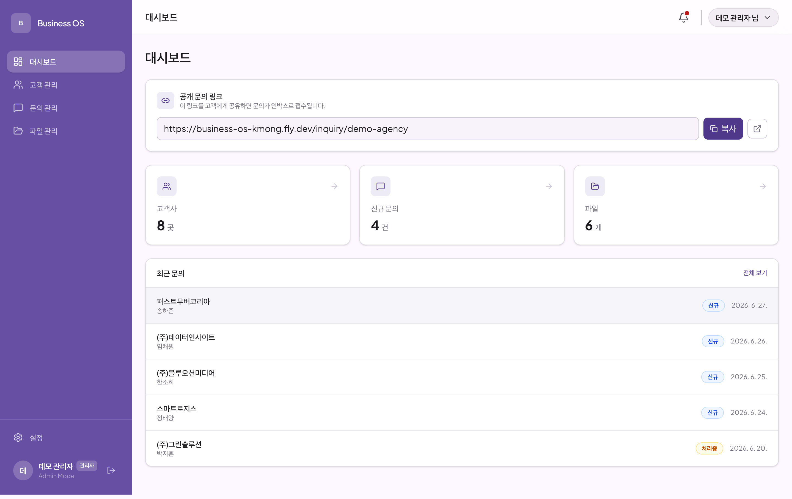
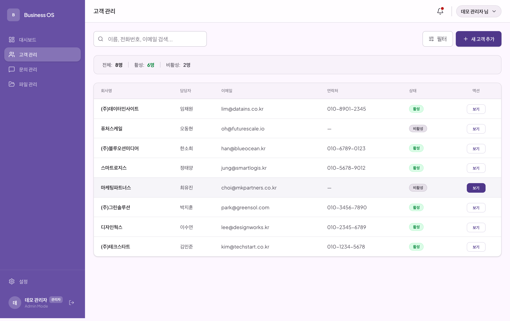
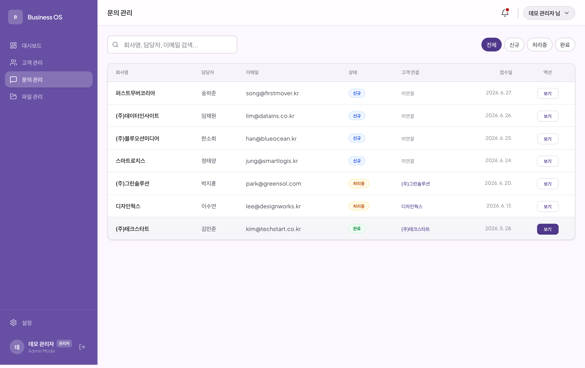
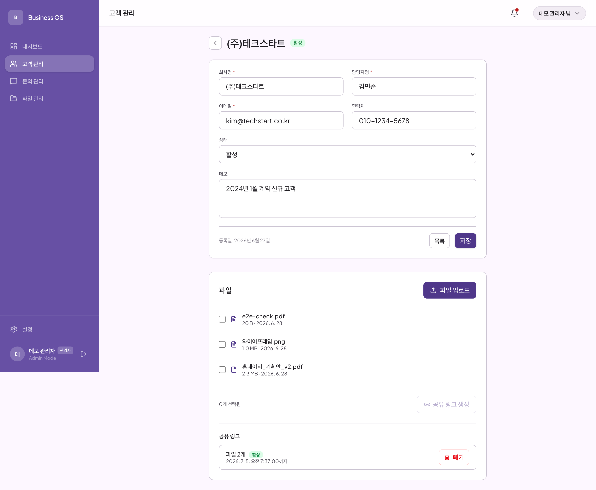
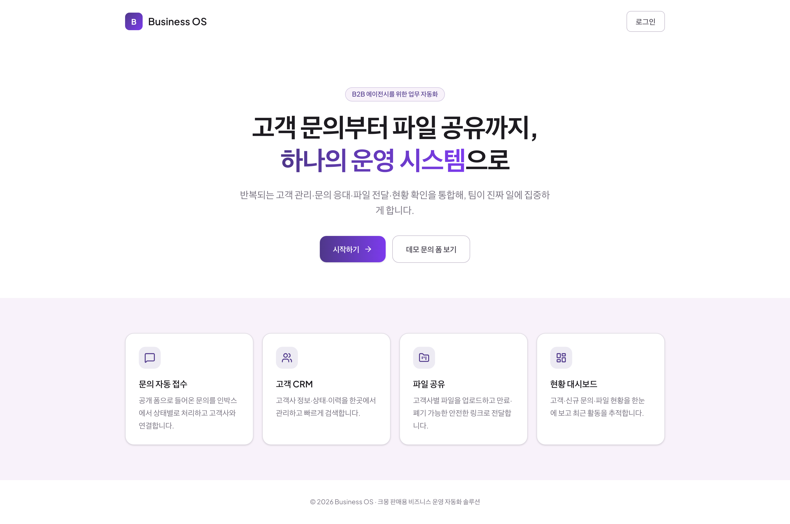
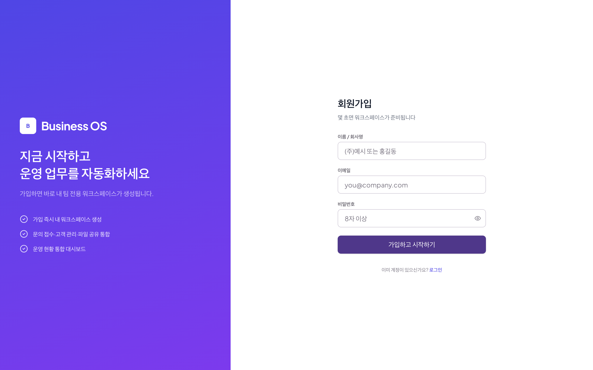
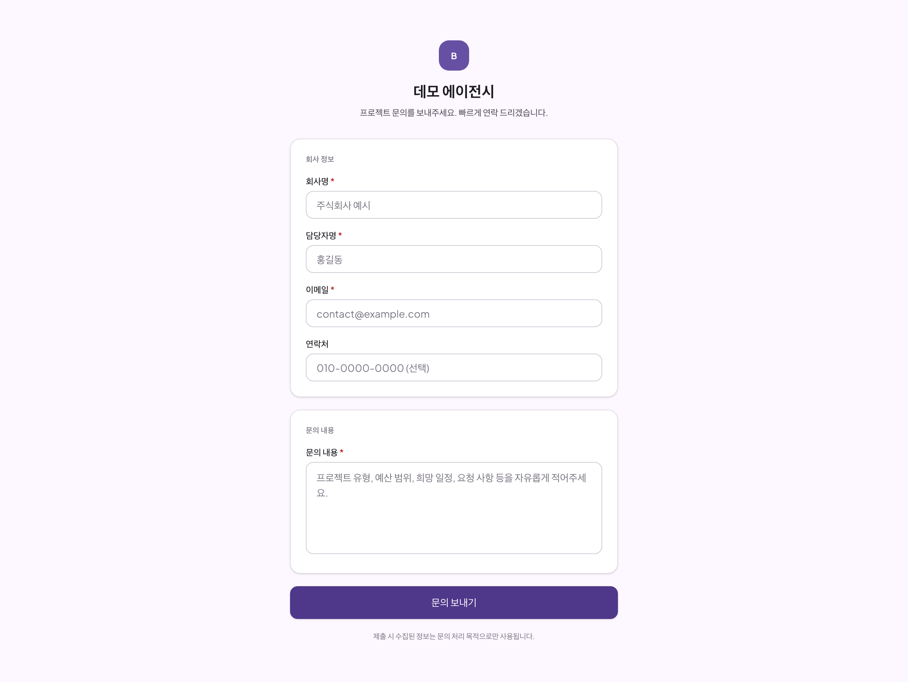
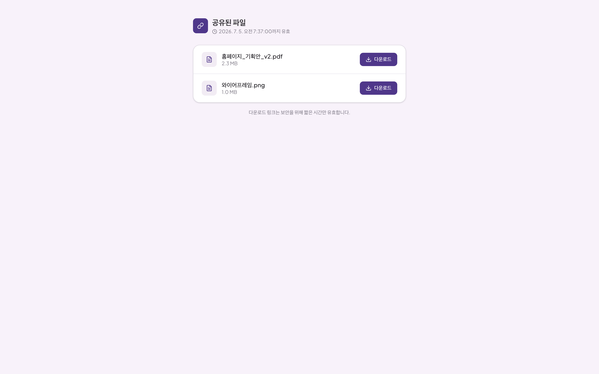
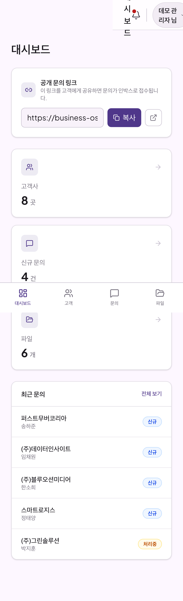
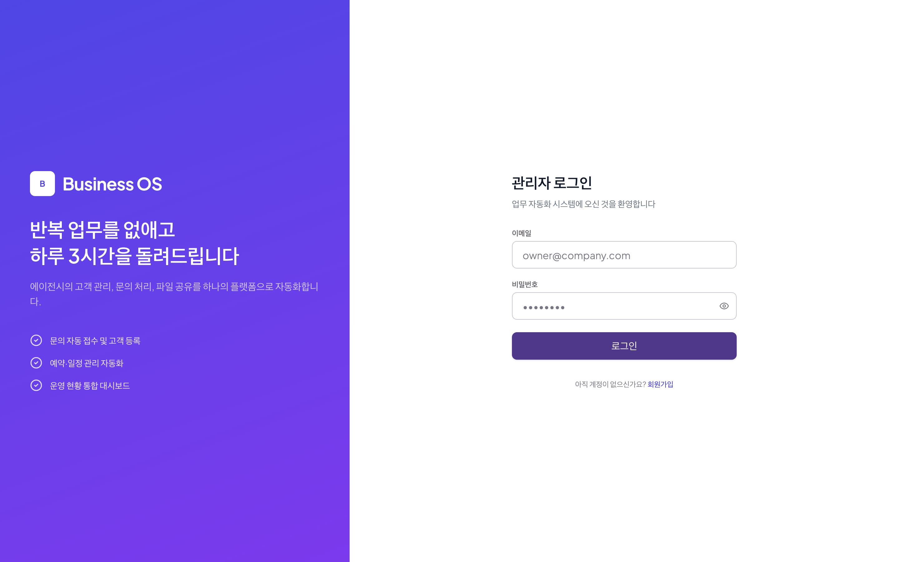

# Business OS

> B2B 에이전시를 위한 **멀티테넌트 업무 운영 SaaS** — 고객 문의 접수부터 CRM·파일 공유·이메일 알림·현황 대시보드까지 하나의 흐름으로 연결합니다.

**🔗 라이브 데모: https://business-os-kmong.fly.dev**

| 체험 방법 | 계정 |
|---|---|
| 바로 둘러보기(데모 데이터) | `owner@demo-agency.com` / `demo1234!` |
| 직접 워크스페이스 만들기 | `/signup` 에서 가입 → 내 전용 워크스페이스 자동 생성 |
| 공개 문의 폼(고객 시점) | `/inquiry/demo-agency` |

---

## 📌 목차

- [스크린샷](#스크린샷)
- [무엇을 해결하나](#무엇을-해결하나)
- [핵심 기능](#핵심-기능)
- [기술 스택](#기술-스택)
- [아키텍처](#아키텍처)
- [기술적 하이라이트](#기술적-하이라이트)
- [품질·테스트·CI](#품질테스트ci)
- [배포·운영](#배포운영)
- [로컬 개발](#로컬-개발)
- [로드맵](#로드맵)

---

## 스크린샷

| 대시보드 | 고객 관리 |
|---|---|
|  |  |
| **문의 인박스** | **고객 상세 · 파일 공유** |
|  |  |

<details>
<summary>랜딩 · 가입 · 공개 문의/공유 · 모바일 더 보기</summary>

| 랜딩 | 회원가입 |
|---|---|
|  |  |
| **공개 문의 폼(고객 시점)** | **공개 공유 화면(고객 시점)** |
|  |  |
| **모바일 대시보드** | **로그인** |
|  |  |

</details>

---

## 무엇을 해결하나

에이전시는 **문의 응대 → 고객 등록 → 파일 전달 → 상태 확인** 을 이메일·엑셀·메신저에 흩어서 반복합니다. Business OS는 이 흐름을 한 워크스페이스로 통합해 반복 업무를 줄입니다.

- **대상**: 고객 프로젝트를 다루는 소규모 B2B 에이전시
- **모델**: 자가 가입형 멀티테넌트 SaaS (가입 즉시 팀 전용 워크스페이스 프로비저닝)

## 핵심 기능

- **공개 문의 접수** — 워크스페이스별 공개 폼(`/inquiry/{slug}`) → 관리자 인박스로 접수(honeypot·requestId 멱등)
- **고객 CRM** — tenant 범위 고객 CRUD·검색·상태 필터·페이지네이션
- **파일 업로드·공유** — 브라우저가 S3/R2에 **직접(presigned) 업로드**(서버 미중계), 만료·폐기 가능한 공유 링크(15분 다운로드 URL)
- **이메일 알림** — 문의 접수·파일 공유 시 발송, PENDING/SENT/FAILED 로그 + 이중 멱등
- **현황 대시보드** — 고객·신규 문의·파일 집계 + 최근 문의 + 공개 문의 링크
- **인증·워크스페이스** — 이메일/비번, 가입 시 Tenant + OWNER 자동 생성, tenant 데이터 완전 격리

## 기술 스택

| 영역 | 기술 |
|---|---|
| 프레임워크 | Next.js 16 (App Router, Server Components, Server Actions) |
| 언어 | TypeScript 5.9 (strict) |
| 스타일 | Tailwind CSS 4 |
| DB / ORM | PostgreSQL (Supabase) · Prisma 7 (`@prisma/adapter-pg`) |
| 인증 | Better Auth |
| 스토리지 | AWS S3 호환 (Cloudflare R2) · presigned URL |
| 이메일 | Resend |
| 테스트 | Vitest (단위·service) · Playwright (E2E) |
| CI/CD | GitHub Actions (PostgreSQL service + E2E) |
| 배포 | Docker (multi-stage, Next standalone) → Fly.io |

## 아키텍처

```
화면 (Server/Client Component)   ← 인증 가드 · 데이터 조회 · 렌더
        │
도메인 모듈 (modules/*)           ← schema(Zod) · repository(Prisma) · service(오케스트레이션) · actions(Server Action)
        │
lib (외부 경계)                   ← db(PrismaPg) · s3(R2) · resend · 순수 정책 모듈
```

- UI는 Prisma·S3·Resend를 직접 호출하지 않고 `modules`/`lib` 경계를 통합니다.
- presigned URL·다운로드 redirect 처럼 HTTP 응답 계약이 필요한 흐름만 Route Handler(`api/*`)로 처리합니다.
- 순수 정책 모듈(`file-policy`·`share-token`·이메일 `templates`)은 `server-only` 의존 없이 단위 테스트합니다.

> 상세 구조·데이터 흐름·기술 결정: [`docs/ARCHITECTURE.md`](docs/ARCHITECTURE.md)

## 기술적 하이라이트

- **멀티테넌트 격리** — 모든 데이터 접근이 `tenantId` 범위. 가입 시 `databaseHooks` 로 Tenant + OWNER 멤버십을 트랜잭션 프로비저닝(slug 충돌 재시도·멱등).
- **서버 미중계 파일 전송** — presign → 브라우저가 S3/R2에 직접 PUT → complete(HeadObject 검증). 파일 본문이 앱 서버를 거치지 않아 확장성·비용 유리.
- **멱등성 3종** — 문의(`requestId`) · 업로드(`uploadId`) · 알림(`idempotencyKey`, DB unique + provider 헤더 이중).
- **안전한 공유 링크** — 토큰 원문은 1회만 노출하고 sha256 해시만 저장, 만료·폐기·15분 GET URL.
- **S3 호환 추상화** — `S3_ENDPOINT` 하나로 AWS S3 ↔ Cloudflare R2 전환(checksum 이슈 대응 포함).
- **Prisma 마이그레이션** — 기존 DB `migrate resolve` baseline → CI·운영 `migrate deploy` 파이프라인.

## 품질·테스트·CI

- **테스트 87+** — 순수 로직(정책·토큰·스키마) 단위 + service 오케스트레이션(멱등·교차 tenant 가드·발송 분기) mock + Playwright E2E(로그인·문의→인박스·고객 CRUD·반응형).
- **CI (GitHub Actions)** — 매 PR에서 PostgreSQL service 위에 `migrate deploy → seed → lint → typecheck → test → build → Chromium E2E` 전 과정 실행.
- 실제로 CI의 E2E가 모바일 가로 overflow 회귀를 사전 차단한 사례가 있습니다.

## 배포·운영

- **Docker 멀티스테이지** + Next `standalone` 출력으로 ~80MB 경량 이미지, 비루트 실행.
- **Fly.io** 배포(`fly deploy`), 시크릿은 `fly secrets`, 스키마는 Supabase에 `migrate deploy`.
- 빌드 시 placeholder env로 통과하고 런타임 값으로 동작(시크릿 이미지 미포함).

## 로컬 개발

> Node.js 24 · pnpm 11 필요

```bash
pnpm install
cp .env.example .env          # 값 채우기 (Supabase/R2/Resend/BetterAuth)
pnpm exec prisma migrate deploy && pnpm db:seed
pnpm dev                      # http://localhost:3000

pnpm check                    # lint + typecheck + test + build
pnpm test:e2e                 # Playwright (로컬 DB·브라우저 필요)
```

## 로드맵

MVP 이후 계획:

- 비밀번호 재설정 · 가입 이메일 인증
- 결제·구독(플랜) 연동
- 예약 관리 · 프로젝트 보드 모듈
- 알림 실패 자동 재시도 worker · 모니터링/관측성

---

_설계·구현 이력은 [`docs/specs/`](docs/specs/) 와 [`.Codex/`](.Codex/) 에 정리되어 있습니다._
