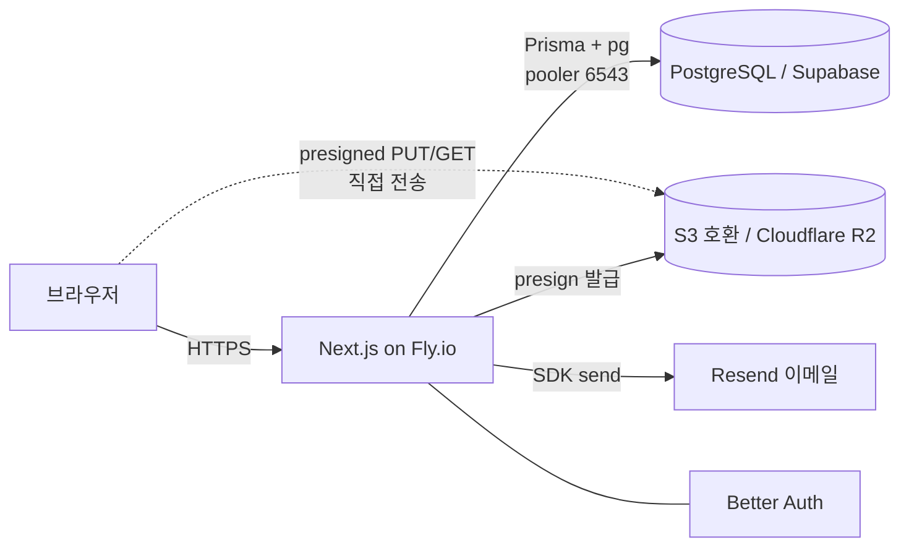

# 아키텍처 & 기술 케이스 스터디

> Business OS 의 시스템 구조·주요 흐름·기술 결정과, 구현 과정에서 마주한 문제를 어떻게 해결했는지 정리한 문서입니다.

## 목차

- [1. 시스템 토폴로지](#1-시스템-토폴로지)
- [2. 레이어 아키텍처](#2-레이어-아키텍처)
- [3. 핵심 흐름](#3-핵심-흐름)
- [4. 데이터 모델](#4-데이터-모델)
- [5. 기술 결정](#5-기술-결정)
- [6. 기술 케이스 스터디 (문제 해결)](#6-기술-케이스-스터디-문제-해결)

---

## 1. 시스템 토폴로지



- 파일 본문은 **브라우저 ↔ R2 직접** 전송(presigned). 앱 서버는 URL만 발급/검증합니다.
- 런타임은 pooler(6543), CLI/마이그레이션은 세션 연결(5432)을 사용합니다.

## 2. 레이어 아키텍처

```
화면 (Server/Client Component)
      │  인증 가드 · 데이터 조회 · 렌더
도메인 모듈 (src/modules/*)
      │  schema(Zod) · repository(Prisma) · service(오케스트레이션) · actions(Server Action)
lib (외부 경계, src/lib/*)
      │  db(PrismaPg) · s3(R2) · resend · 순수 정책 모듈(file-policy · share-token)
```

- **단방향 의존**: UI → modules → lib. UI 는 외부 SDK를 직접 부르지 않습니다.
- **순수 모듈 분리**: 정책·토큰·이메일 템플릿은 `server-only` 의존 없이 분리해 단위 테스트 가능하게 했습니다.
- **HTTP 계약만 Route Handler**: presigned URL·다운로드 302 redirect 등은 `app/api/*`.

## 3. 핵심 흐름

**공개 문의 접수**
```
/inquiry/{slug} 제출 → inquiry.submitInquiry(requestId 멱등)
  → notification.notifyInquiryReceived (OWNER 메일, 비차단)
  → 관리자 인박스에서 상태 변경·고객 연결
```

**파일 업로드·공유**
```
presign(정책 검증·S3 key 예약·5분 PUT) → 브라우저가 R2에 직접 PUT
  → complete(HeadObject 확인·FileItem 확정)
  → 공유 링크 생성(token 1회 노출/hash 저장, 7일 만료)
  → 고객 /share/{token} → 다운로드(15분 presigned GET, 302)
```

**가입·워크스페이스 프로비저닝**
```
signUp.email → Better Auth databaseHooks.user.create.after
  → provisionWorkspace: Tenant(고유 slug) + OWNER Membership 트랜잭션 생성(멱등·slug 충돌 재시도)
```

## 4. 데이터 모델

- `Tenant` — 워크스페이스(고유 slug). Customer·Inquiry·File·ShareLink·NotificationLog 를 소유.
- `User`/`Session`/`Account`/`Membership` — Better Auth 인증 + tenant 역할(OWNER/MEMBER).
- `Customer` · `Inquiry`(requestId 멱등) · `FileUpload`→`FileItem`(uploadId 멱등) · `ShareLink`/`ShareLinkFile` · `NotificationLog`(idempotencyKey 멱등).

모든 tenant 소유 테이블은 `tenantId` 범위 조회로 교차 접근을 차단합니다.

## 5. 기술 결정

| 결정 | 이유 |
|---|---|
| Server Actions + Route Handler 혼용 | 폼 처리는 Server Action, presigned/redirect 등 HTTP 응답 계약은 Route Handler로 분리 |
| presigned 직접 업로드 | 파일 본문을 서버가 중계하지 않아 확장성·비용·메모리 유리 |
| S3 호환 추상화(`S3_ENDPOINT`) | AWS S3 ↔ Cloudflare R2 를 코드 변경 없이 전환 |
| Prisma 마이그레이션 도입 | db push → migrate로 스키마 변경 추적·롤백 가능 |
| Docker standalone | 경량 이미지(~80MB)·재현 가능한 배포 |

## 6. 기술 케이스 스터디 (문제 해결)

실제 구현·배포 과정에서 마주한 문제와 해결 방식입니다.

### 6-1. 서버 미중계 파일 전송 + S3 → R2 전환
- 브라우저가 R2에 직접 PUT 하도록 presigned URL을 발급. 앱 서버는 정책 검증과 `HeadObject` 확정만 담당.
- 비용 절감을 위해 AWS S3 → Cloudflare R2로 전환. `S3_ENDPOINT` + `forcePathStyle` 로 처리하되, **최신 aws-sdk 의 기본 checksum 헤더가 R2 presigned PUT 서명을 깨뜨리는** 이슈를 `requestChecksumCalculation: "WHEN_REQUIRED"` 로 해결.

### 6-2. 멀티테넌트 격리와 자동 프로비저닝
- 모든 repository 조회를 `tenantId` 범위로 강제해 교차 tenant 접근을 차단.
- 자가 가입 SaaS 전환 시, 가입만으로 워크스페이스가 없으면 사용자가 진입 불가. Better Auth `databaseHooks.user.create.after` 에서 Tenant + OWNER 를 트랜잭션 생성하고, slug 충돌 시 재시도·기존 소속 시 skip(멱등)하도록 구현. 라이브에서 가입→격리된 빈 워크스페이스 생성을 검증.

### 6-3. 배포 환경에서만 터진 DB 연결
- 로컬은 되는데 배포에서 `P1001 DatabaseNotReachable`. 원인은 (1) raw `pg.Pool` 이 관리형 DB에 필요한 **SSL을 켜지 않음**, (2) 초기엔 연결 문자열 형식 오류. prisma CLI는 SSL을 자동 적용해 로컬 마이그레이션은 통과했지만 앱 런타임은 실패했던 것. 비-로컬 호스트에 `ssl` 활성화로 해결.

### 6-4. 로그인 후 /login 으로 튕기는 race
- 로그인 성공 후 `router.push`(soft nav)와 세션 쿠키 커밋 사이의 race로 간헐적으로 `/login` 복귀. production 환경의 rate limit까지 겹쳐 flaky. 로그인 후 **full navigation** + E2E는 **storageState 로 1회 로그인 재사용**으로 안정화.

### 6-5. Prisma 마이그레이션 baseline
- 초기에 `db push` 로 만든 운영 DB에 마이그레이션 체계를 도입. 기존 테이블을 재생성하지 않도록 `migrate resolve --applied 0_init` 로 baseline 처리 후, 이후 변경(예: `Account` unique 인덱스)을 `migrate deploy` 파이프라인으로 안전하게 적용.

### 6-6. CI가 잡은 회귀
- 대시보드에 링크 카드를 추가하자 모바일(390px)에서 가로 overflow 발생 → Playwright 반응형 E2E가 CI에서 이를 잡음. flex 자식에 `min-w-0` 를 추가해 해결. **테스트가 실제 회귀를 사전 차단한 사례.**

### 6-7. 빌드 시점 인라인 환경변수 함정
- `NEXT_PUBLIC_*` 는 서버 코드에서도 **빌드 시점에 인라인**되어, Docker 빌드의 placeholder(localhost)가 클라이언트 번들·서버 액션에 박혀 CORS·잘못된 링크를 유발. auth 클라이언트는 baseURL을 제거해 현재 origin을 쓰게 하고, 링크 생성은 런타임 값(`BETTER_AUTH_URL`)으로 교체.
